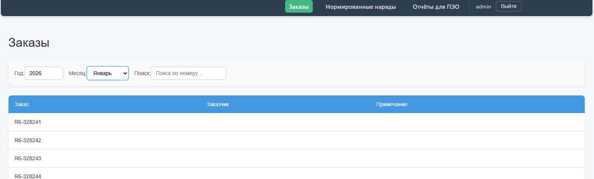
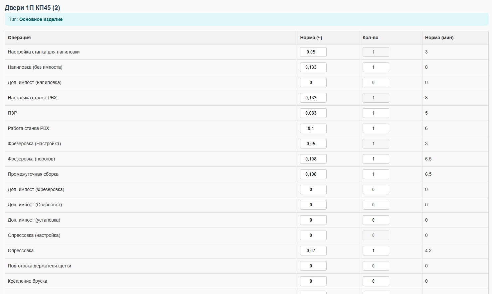
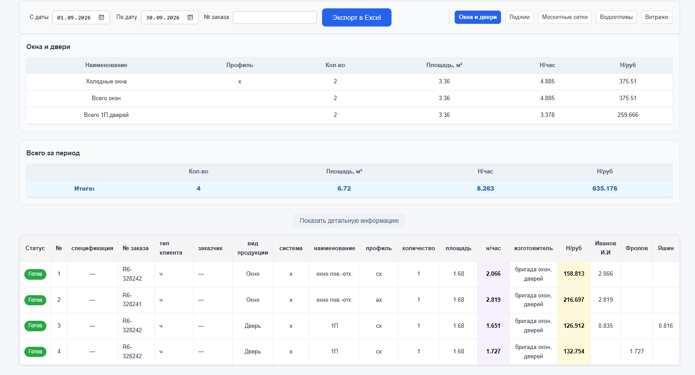

# Сервис нормирования (peo-backend)


Внутренний production-сервис для планово-экономического отдела (ПЭО) производства алюминиевых конструкций (двери, окна, лоджии, витражи). Автоматизирует расчёт трудовых норм на изготовление изделий и формирование отчётности.

## Что делает сервис

1. **Сбор данных по заказу** — по заказу (двери, окна, лоджии, витражи) собираются материалы и детали, на основе которых строится контекст для автоматического нормирования.
2. **Расчёт норм** — на основе материалов рассчитываются операционные нормы на изготовление изделия и формируются печатные нормы для производства.
3. **Учёт исполнения** — сотрудники ПЭО назначают на операции исполнителей и проводят заказ по факту изготовления.
4. **Отчётность** — проведённые заказы попадают в отчёты, которые можно скорректировать при необходимости и выгрузить статистику в Excel.

## Стек технологий

**Backend**
- Go 1.24
- [chi](https://github.com/go-chi/chi) + [chi/render](https://github.com/go-chi/render) — роутинг и рендеринг ответов
- MySQL 8.0, драйвер [go-sql-driver/mysql](https://github.com/go-sql-driver/mysql)
- [golang-migrate](https://github.com/golang-migrate/migrate) — миграции схемы БД
- [cleanenv](https://github.com/ilyakaznacheev/cleanenv) — чтение конфигурации (YAML + переменные окружения)
- [excelize](https://github.com/xuri/excelize) — генерация Excel-отчётов

**Тестирование**
- [testify](https://github.com/stretchr/testify) — assertions и моки
- [go-sqlmock](https://github.com/DATA-DOG/go-sqlmock) — мокирование SQL-запросов в тестах

**Frontend**
- Vue SPA раздаётся встроенным HTTP-сервером Go с поддержкой SPA fallback.

**Инфраструктура**
- Docker / Docker Compose
- GitHub Actions — тесты, линтер, сборка Docker-образа на каждый push
- [golangci-lint](https://golangci-lint.run/) — статический анализ кода
- [Task](https://taskfile.dev/) — единая точка входа для команд разработки

## Скриншоты

### Список заказов


### Список операций


### Отчёты ПЭО


## Быстрый старт

Понадобится только Docker и Docker Compose.

```bash
git clone https://github.com/Scipiia/peo-backend.git
cd peo-backend

cp .env.example .env

docker compose up --build
```

После запуска:
- Приложение — http://localhost:8080
- Учётная запись администратора — задаётся в `.env` (`ADMIN_LOGIN` / `ADMIN_PASS`)

Если установлен [Task](https://taskfile.dev/installation/), доступны короткие команды:

```bash
task up      # поднять весь стек (docker compose up --build)
task down    # остановить и удалить контейнеры вместе с volume
task logs    # смотреть логи всех контейнеров
task test    # прогнать тесты
task lint    # прогнать линтер
task build   # собрать бинарники backend и migrate локально
```

Полный список команд — `task --list`.

## Архитектура

```
├── cmd/
│   ├── dem/                    # точка входа backend-сервера, роутинг
│   └── migrate/                 # отдельный бинарник для применения миграций БД
├── http-server/                 # HTTP-хендлеры, сгруппированы по доменам
│   ├── order-dem/                # заказы
│   ├── order-norm/                # нормированные заказы
│   ├── recalculate-norm/           # пересчёт норм
│   ├── generate-report/            # генерация Excel-отчётов
│   ├── template/                    # шаблоны норм
│   ├── workers/                      # исполнители операций
│   ├── materials/                     # материалы
│   ├── admin/                          # администрирование
│   ├── auth/                            # аутентификация
│   └── health/                           # health-check / readiness
├── internal/
│   ├── auth-ldap/                # JWT + LDAP
│   ├── config/                    # загрузка конфигурации
│   ├── constants/                  # справочники материалов
│   ├── middleware/auth/             # Basic Auth middleware
│   ├── migration/                    # логика применения миграций
│   ├── service/
│   │   ├── generate-excel/            # формирование Excel-отчётов
│   │   └── recalculate/                # бизнес-логика расчёта норм
│   └── storage/mysql/                   # работа с БД
├── migrations/                    # SQL-миграции (golang-migrate)
├── config/                         # конфигурация (local — не в git, docker — demo-версия)
├── frontend-dist/                   # собранная статика Vue 3
├── Dockerfile
├── docker-compose.yml
└── Taskfile.yml
```

Миграции применяются отдельным короткоживущим контейнером **до** старта backend — это гарантирует, что сервис никогда не стартует с рассинхронизированной схемой БД (см. `depends_on: migrate: condition: service_completed_successfully` в `docker-compose.yml`).

Хендлеры (`http-server/`) и бизнес-логика (`internal/service/`) разделены явно: HTTP-слой отвечает только за приём/валидацию запроса и формирование ответа, расчёт норм и генерация отчётов вынесены в сервисный слой и тестируются отдельно от транспорта.

**Раздача фронтенда.** Собранная Vue-статика (`frontend-dist`) раздаётся напрямую Go-сервером через `chi`: статика (`/js/*`, `/css/*`, `/img/*`, `/assets/*`) отдаётся через `http.FileServer`, а любой другой путь без соответствующего файла на диске возвращает `index.html` — это SPA fallback, необходимый, чтобы обновление страницы на клиентских роутах Vue Router (например, `/orders/123`) не приводило к 404 от сервера.

## Тестирование и качество кода

Основные сервисы и HTTP-хендлеры покрыты unit-тестами; для работы с БД используются sqlmock.

В CI на каждый push прогоняются: юнит-тесты, сборка бинарников, `golangci-lint`, сборка Docker-образа. Конфигурация линтера — [`.golangci.yml`](.golangci.yml).

```bash
go test ./...
golangci-lint run ./...
```

## Конфигурация

Приложение читает настройки из YAML-файла (`CONFIG_PATH`) и переменных окружения (`.env`). Секреты (пароли БД, JWT-секрет, учётные данные администратора) — только через переменные окружения, в `config/*.yaml` не хранятся.

| Переменная | Назначение |
|---|---|
| `DB_USER`, `DB_PASSWORD`, `DB_HOST`, `DB_PORT`, `DB_NAME` | подключение к MySQL |
| `JWT_SECRET` | секрет для подписи JWT-токенов |
| `ADMIN_LOGIN`, `ADMIN_PASS` | учётная запись администратора |

Пример — [`.env.example`](.env.example).

## Планы на будущее

- [ ] Полноценная авторизация по ролям (текущая реализация — заготовка)
- [ ] LDAP-интеграция для входа через доменную учётную запись
- [ ] Swagger-документация API
- [ ] Повышение покрытия тестами узких мест бизнес-логики